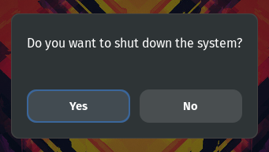

# Shutdown Dialogue Extension

This GNOME Shell extension provides a custom keybinding for Alt+F4 to show a shutdown dialogue when no windows are open.

# Screenshots



## Features

- Overrides the default Alt+F4 keybinding.
- Shows a notification when Alt+F4 is pressed and no windows are open.
- Restores the original keybinding when the extension is disabled.

## Installation

### Automatic Installation

1. Install the extension from the GNOME Extensions website:
    
    [Shutdown Dialogue Extension](https://extensions.gnome.org/extension/7444/shutdown-dialogue/)
    
    [](https://extensions.gnome.org/extension/7444/shutdown-dialogue/)

### Manual Installation

1. Clone the repository to your local machine:
    ```sh
    git clone https://github.com/PublisherName/shutdown-dialogue-gs-extension.git
    ```

2. Navigate to the extension directory:
    ```sh
    cd shutdown-dialogue-gs-extension
    ```

3. Copy the extension to the GNOME Shell extensions directory:
    ```sh
    ./build.sh
    ```

4. Restart GNOME Shell:
    ```sh
    Press Alt+F2, type 'r', and press Enter
    ```

5. Enable the extension using GNOME Tweaks or Extensions app.

## Usage

- Press Alt+F4 to trigger the shutdown dialogue when no windows are open.
- The extension will show a dialogue when no windows are open and asking if you want to shut down.

## Contributing

Contributions are welcome! Please open an issue or submit a pull request.

## Icon Credits

Icons from [icon-icons.com](https://icon-icons.com/icon/blue-shutdown-power-off-/11699):

## License

This project is licensed under the MIT License. See the [LICENSE](LICENSE) file for details.